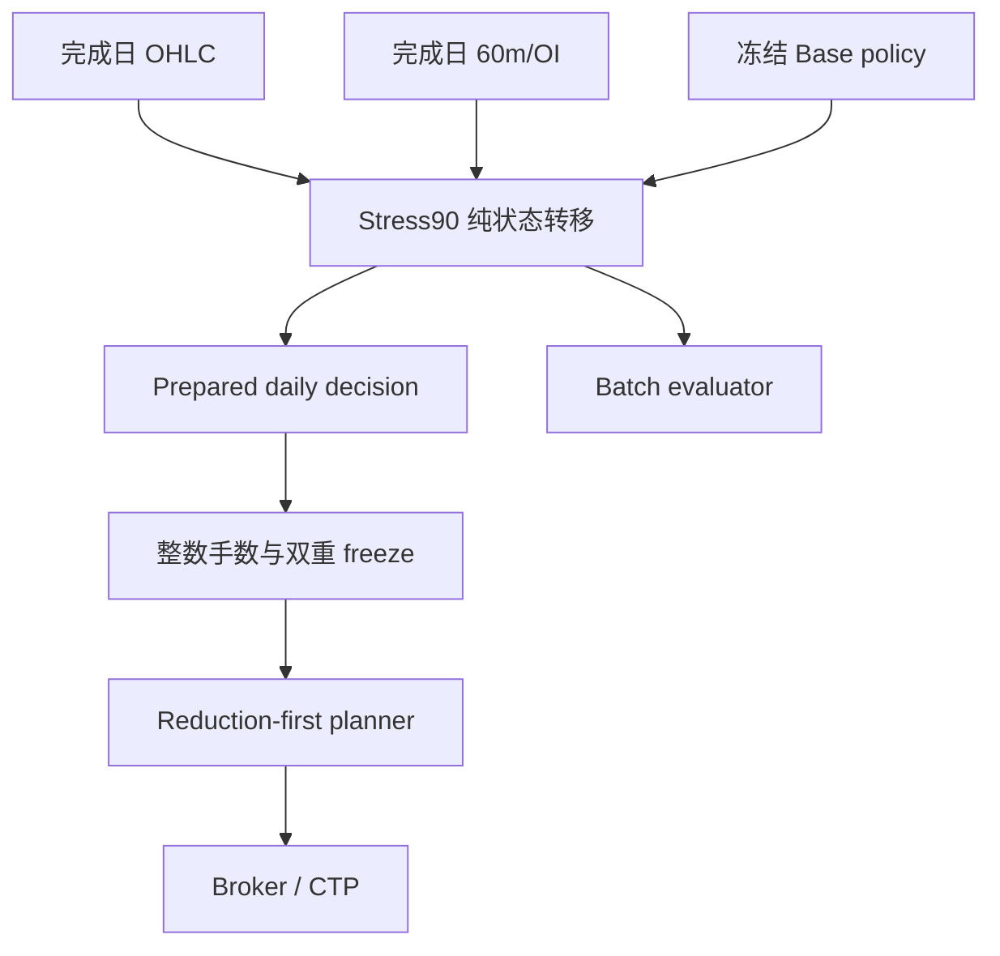

# Stress-90 实盘接入设计

## 1. 目标与基线

本设计从 `main` 提交 `da8de59304963c7b1d6737a63e8dadd6eaecd860` 开始，目标是把固定历史候选 Stress-90 作为一个显式、可选、失败关闭的方向组合生产策略接入 Shadow、测试柜台和 CTP 实盘基础链。实现不得改变 Stress-90 的经济行为，也不得改变普通 `execution_aligned` 模式的既有经济行为。

Stress-90 的固定身份包括：

- 50 个冻结品种；
- 96 个冻结模板；
- meta lookback/rebalance/count 为 `11/3/3`；
- Base/Stress 成本端点为单边 `5bp/15bp`；
- 9 个 OI 支持品种 `A,C,EG,I,M,P,PP,TA,Y`；
- 成本门 `20` 个完成交易日、`3` 个交易日 benefit、严格高于 `15bp`；
- HHI 与 strictly-prior expanding median 比较，先比较后追加；
- 软回撤预留为 `30% - 5% = 25%`；
- target/realized gross `<=2x`、margin `<=35%`、available `>=25%`、单合约 `<=35` 手、margin estimate buffer `>=1.25`；
- 历史候选权重摘要 `8e38dbf6441b561dd1728df08665b94b15cc3358823257505c2fcb9d63f09f28`。

代码接入、Shadow、测试柜台、极小真钱和扩大资金是六个不同的许可阶段。代码完成不会自动取得任何真实资金权限。

## 2. 当前差异

当前生产工厂只创建 `ExecutionAlignedDirectionalPortfolioManager`。`DirectionalTradingEngine` 会把任意未包装 policy 自动装饰为 `DirectionalRiskScaledPolicy`，因此 Stress-90 若直接接入会再次乘以 `0.25`。Stress-90 的 OI、成本门、survivor、HHI 和 drawdown reserve 分散在研究/acceptance 适配器中，部分模块反向依赖 `directional_acceptance`。现有日线 provider 还可能从调仓调用栈同步访问网络。

这些差异意味着当前 live 既不是 Stress-90，也不具备相同输入下的逐日目标一致性、exactly-once 决策或生产级 60m OI 证据。

## 3. 总体架构

采用“共享纯候选核心、独立生产状态、Broker 原始证据、独立 runtime adapter”的结构。



核心依赖方向为：

1. `directional_stress90_policy` 只依赖纯领域/数值模块；
2. batch evaluator 与 live runtime 都依赖同一个纯核心；
3. live runtime 不导入 `tools`、CLI、`directional_acceptance` 或研究入口；
4. Broker、账户和订单只在 runtime/planner 层出现；
5. 运维、status、doctor、quality 只读取并展示证据，不拥有交易权限。

## 4. Policy definition 与摘要

新增不可变 `Stress90PolicyDefinition`。定义对象保存 policy id、definition version、50 品种 manifest、9 个 OI 品种、模板摘要、`20/3/15bp`、HHI 规则、25% reserve 公式、历史候选 SHA 和硬风险包络。

摘要分为三类，严禁混用：

- `policy_definition_digest`：固定定义和常量的规范 JSON SHA-256；
- `historical_candidate_weight_sha256`：固定历史完整候选权重路径摘要；
- `daily_decision_digest`：某一个 target trading day 的输入、分层输出和 post-state 摘要。

所有摘要都使用排序后的产品身份和确定性浮点编码。未来目标不能伪装成历史完整路径摘要。

## 5. 纯 incremental 候选核心

核心接口为：

```python
def step_stress90_candidate(
    prior_state: Stress90CandidateState,
    target_trading_day: str,
    base_weights: Mapping[str, float],
    completed_close_history: Mapping[str, Sequence[float]],
    completed_close_days: Sequence[str],
    completed_oi_flow: Mapping[str, int | None],
    completed_oi_day: str,
    definition: Stress90PolicyDefinition = STRESS90_POLICY,
) -> Stress90Decision:
    ...
```

状态转移严格执行：

1. 校验 target day 单调、产品 manifest、输入日、finite、gross 和 OI 完整性；
2. 以 prior OI-confirmed state 应用 entry/add/reversal 确认；
3. 用目标日前已经完成的 20 个日收益算术和计算 3 日 benefit；
4. 成本门仅形成 survivor support；
5. 以 prior survivor state 做 tracking-first、turnover-second 确定性 reallocation；
6. 在 raw survivor candidate 上计算 HHI；
7. 与严格早于当前日的 HHI 有限历史中位数比较；
8. 先确定 freeze flag，再把当前有限 HHI 追加到 post-state；
9. 生成完整分层输出和 daily decision digest。

对 9 个支持品种，`completed_oi_flow=None` 表示 missing/incomplete，并使整个 target input 不完整；`0` 是已证明价格方向为零或持仓量未增加。两者不能通过 `fillna(0)` 合并。不支持的 41 个品种不读取 OI flow。

Batch wrapper 逐日调用同一 `step_stress90_candidate`，不再拥有另一套公式。原研究函数保留兼容入口，但内部委托共享核心。逐日、逐产品比较是 parity 权威，最终收益指标不能替代权重 parity。

## 6. Policy state 与 exactly-once

Stress-90 使用独立 sidecar state，不把旧 execution-aligned runtime state 静默解释成 Stress-90 state。状态 envelope 包含 schema version、递增 sequence、checksum、原子替换和 `.prev` 证据；当前文件损坏时不自动回退。

状态包括：

- policy id、definition digest、产品 manifest digest；
- bootstrap source manifest、through day 和 seed digest；
- last completed target/input day 与 last decision digest；
- last OI-confirmed、cost-approved、survivor weights；
- completed HHI values；
- pending/prepared decision；
- completed account wealth、high watermark、last completed account day；
- 最近两日完成收益，仅供 adaptive margin；
- live inception day。

一个 target day 的准备事务只有两种结果：

- 当前日不存在：计算 post-state，把 decision 与 post-state 一次原子保存，然后才允许读取 Broker 机械输入并规划订单；
- 当前日已存在且 digest/identity 一致：复用 persisted decision，不再次追加 HHI 或推进三层 target state。

持久化失败时不得调用 `send_order`。决策保存后崩溃、部分成交后崩溃或同日重复运行，都继续以 Broker 当前持仓向同一个 persisted target 收敛。

账户完整回撤路径用数学等价充分统计量保存：

```text
completed_wealth *= 1 + completed_return
completed_high_watermark = max(previous_hwm, completed_wealth)
completed_drawdown = completed_wealth / completed_high_watermark - 1
```

完整收益列表算法与充分统计量算法必须通过逐日等价测试。充值、出金或更换账户只能通过显式 rebase 命令，并要求 HALTED、空仓、无活动委托、有效快照、reconcile 通过和强确认。

## 7. Bootstrap

`afuture stress90-bootstrap` 只接受五个固定输入，并先验证文档中记录的 SHA-256：

- `broad_daily_universe.csv`；
- `return_target_specific_contracts.csv`；
- `execution_aligned_weights.csv`；
- `prior_two_year_broad_60m.csv`；
- `two_year_broad_60m.csv`。

Bootstrap 先使用生产 `ExecutionAlignedAggressivePolicy.weight_history` 重建 Base path，并逐日校验固定权重文件；再通过共享 Stress-90 核心重建 OI、成本和 survivor path；随后验证候选摘要。Bootstrap 同时执行 incremental/batch 逐日 parity，并写入不可覆盖的 seed artifact、初始 policy state 和可补推历史的 completed OI evidence。

Seed 不包含任何账户或 CTP 凭证。历史回测账户收益不会写入 live soft account path；live wealth/HWM 从 activation inception 开始。固定输入缺失或摘要不一致时命令失败，不下载替代数据，不生成“最新”状态。

## 8. 原始 CTP 60m/OI 证据

CTP adapter 在 Tick 成功转换后、`_enqueue_tick()` 合并前调用只做内存更新的 raw observer。observer 不能做磁盘或网络 I/O，也不能把 Tick 加入 critical FIFO。异常转换或聚合不变量失败会形成 critical broker error。

Broker 暴露可注入 raw observer 接口：

```python
RawTickObserver = Callable[[Tick, ContractInfo | None], None]
```

`CtpBroker` 直接调用；`ShadowBroker` 委托到底层 CTP market broker；`SimBroker` 在 publish/coalesce 前调用，从而使测试、Shadow 和 live 使用同一证据语义。

聚合器按 CTP `trading_day` 归属交易日，按固定产品 session manifest 划分 60 分钟 bar。每个合约记录 first/last tick、first open、last close、first/last hold、非负 cumulative-volume 增量、reset、duplicate、out-of-order、late tick 和已观察 bar bucket。自然日跨午夜不改变交易日。

完成日 evidence 记录预期合约集合、实际集合、缺失集合、每个产品的 dominant symbol 和最终 `-1/0/+1/missing` flow。dominant 规则为最后 OI、当日总成交量、symbol 稳定排序。任一支持品种的 expected contract coverage 不完整时，整个 target input 不完整。

完成日与 in-progress state 分离，交易日 rollover 原子保存。完成一个 bounded broker event batch 后由 engine checkpoint；回调中只更新有界内存。当前文件损坏时失败关闭，不自动使用 `.prev`。

## 9. OHLC cache 与订单路径

Stress-90 runtime 只读取经过 checksum、manifest、日期和不可修订重叠校验的本地 OHLC cache。网络 provider 移到显式 `directional-ohlc-refresh` CLI；该命令没有 Broker 和订单权限。

刷新只能向后追加。provider 删除日期、修改历史值、缺少 50 品种或含非 finite/非正值时拒绝替换 cache。Stress-90 的 `run_once`、`on_tick`、`maybe_rebalance` 以及 order/trade/account callback 不调用 provider 或网络。

cache 不覆盖 required completed signal day 时，空仓拒绝新增风险；有仓进入 `REDUCE_ONLY`。普通 `execution_aligned` 模式继续保留现有 provider 行为，以避免未经授权的兼容回归。

## 10. 权威交易日、补推和执行窗口

Stress-90 target day 只来自 `Broker.get_trading_day()`。本机日期、UTC 日期和 `pandas.BDay` 不能决定 live target identity。

上一完整 activity day 同时是所需 OHLC/OI input day。若 state 与当前 target 之间存在多个已完成交易日，runtime 用 verified OHLC session index 与 OI evidence 按顺序逐日补推；任何中间 input 缺失都停止，不能跳日。

固定 `directional_sessions` manifest 为每个冻结品种声明 exchange、交易段和首个可执行 entry window。夜盘品种只在 target day 的首个夜盘窗口增加风险；无夜盘品种只在日盘首个窗口增加风险。错过窗口后当天不追单，但 prepared target state 仍保持已推进。减仓、退出、反转旧仓和平同品种换月不受 entry deadline 限制。

审计记录 expected open、planned price、actual fill 和 latency。manifest 是版本化 policy 定义的一部分，运行期不自动优化。

## 11. Runtime 与风险响应

`DirectionalRiskResponseMode` 明确区分：

- `TARGET_SCALE`：普通 execution-aligned 继续使用现有 0.25 wrapper；
- `FREEZE_NEW_RISK`：Stress-90 使用 1x raw candidate，不包装 `DirectionalRiskScaledPolicy`。

Stress-90 manager 是独立 adapter。有效输入后的顺序为：

1. 获取 CTP target day；
2. 验证上一 activity/OHLC/OI day；
3. 生成或复用 prepared candidate decision；
4. 获取 Broker account/positions/quotes/specs；
5. 选择具体合约并做 live margin-aware integer sizing；
6. 使用最近两日完成收益做既有 adaptive margin envelope；
7. 使用完整 completed account sufficient state 判断 25% reserve；
8. 在整数 lots 层先应用 drawdown freeze，再应用 HHI freeze；
9. 对不可用 incumbent 产品保持原持仓，不加仓、不换月；
10. 构造 reduction-first plan；
11. reductions 成交后下一轮重读 Broker truth 和 account；
12. openings 再经过 `RiskManager.check_open_orders()`。

两个 freeze 分别记录，且都只阻止新产品风险和同方向加仓；减仓、退出、反转和同品种换月通过。HHI 只读取 raw survivor candidate，不读取账户、持仓、成交或实际整数手数。

## 12. 配置和 policy 切换

`DirectionalConfig.policy` 支持 `execution_aligned` 与 `stress90`。live TOML 必须显式填写；直接构造的旧测试对象和 replay 兼容路径可以把空值解释为 `execution_aligned`，但不能把旧 production state 迁移为 Stress-90。

Stress-90 activation 要求独立 bootstrap。policy identity、definition digest、seed digest 或产品 manifest 不一致时失败关闭。

运行账户切换 policy 必须满足 HALTED、Broker 和本地空仓、无活动委托、完成 reconcile，并执行显式 bootstrap/迁移命令。运行期间禁止手工交易、其他策略、充值和出金。

## 13. 失败关闭矩阵

以下异常一律不猜测：

| 异常 | 空仓 | 有持仓 |
| --- | --- | --- |
| policy state 缺失/损坏或 digest 不一致 | 拒绝启动/HALT | HALT 并人工对账 |
| target/input day gap | 拒绝新增风险 | REDUCE_ONLY |
| OHLC、OI 或 activity 不完整 | 拒绝新增风险 | REDUCE_ONLY |
| CTP trading day 非法或倒退 | HALT | HALT |
| live metadata 不完整 | 拒绝新增风险 | REDUCE_ONLY 或既有硬门 HALT |
| active orders | wait | wait |
| Broker/local position drift | HALT | HALT |
| unknown order/trade | HALT | HALT |
| provider 失败但 cache 完整 | 使用 verified cache | 使用 verified cache |

`.prev` 只供人工检查。异常路径不清除 kill switch、不跳过交易日、不把 missing OI 当作 0，也不产生新增风险。

## 14. Status、Doctor 与质量证据

Status 增加 policy identity、bootstrap、target/input day、OHLC/OI digest、分层 decision digest、HHI、reserve、pending decision、target/current lots、gross、tracking error、gap 和 blocker。

Doctor 保持 `orders_sent=0`，验证 policy state、seed、日期连续性、50 品种 OHLC、9 品种 OI coverage、activity/catalog、live margin/commission、具体合约、整数目标和真实成本兼容性。任一 P0 失败时 `stress90_ready=false`。

质量审计逐日保存 Base、OI、cost、survivor、HHI、两个 freeze、整数 target、最终 frozen target、reduction/opening plan 和 daily decision digest。成交质量保存 expected open、planned price、fill、slippage、commission、单边实际成本、p95、partial/reject、latency、tracking error 和实际/模型 turnover。

如果确定性手续费加最小合理滑点显著超过 15bp，Doctor 把对应合约列为 activation blocker。系统不能动态提高候选成本门；真实成本研究必须使用独立名称和矩阵。

## 15. 测试与交付

实现按六个 checkpoint 推进：

1. shared core 与 batch/incremental parity；
2. state、bootstrap、account sufficient statistics；
3. CTP raw 60m/OI evidence；
4. live runtime、policy capability、exactly-once 与 fail-closed；
5. CLI、status、doctor、quality、真实成本门；
6. 文档、L3/L4、独立对抗审查、PR 和 CI。

开发只运行直接相关测试；每个 checkpoint 运行子系统测试；最终候选稳定后运行一次完整 pytest、Ruff、format、MyPy、compileall、pip check、build、CLI/config/smoke。固定五输入可用时才运行完整 Stress-90/Stress-80 矩阵；缺失时明确记录 blocker。

对抗审查重点检查状态推进、崩溃窗口、重复成交、Tick flood、night session、OI missing/zero、calendar gap、0.25 双重缩放、freeze 动作分类、Broker truth、硬风险绕过、网络阻塞和文档/代码一致性。所有 Critical/Important 必须修复后才允许合并。

最终结论在没有真实 CTP/Shadow/测试柜台证据时固定为：

> Stress-90 live wiring 已完成，但真实资金 activation gate 尚未完成。
